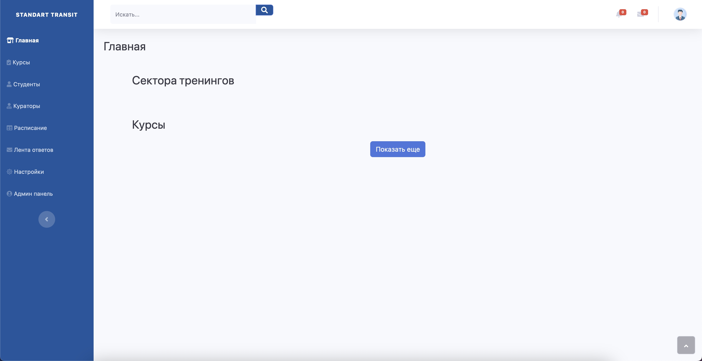

# Standard Transit Company - компания специализирующаяся на повышении квалификаций авиационных и промышленных специальностей.
# АУЦ «Стандарт Транзит» 
ТОО «Стандарт Транзит» основано в 2015 году, специализируется на обучающих программах, тренингах, курсах повышения квалификации.

В лице директора, и заказчика выходит Директор АУЦ "Стандарт Транзит" - Журкабаева Динара.

Цель разработчика:

- Создать образовательную платформу которая будет хранить в себе информацию об уроках, и сами уроки.

P.S. - это мой первый проект, и написание кода оставляет желать лучшего.

